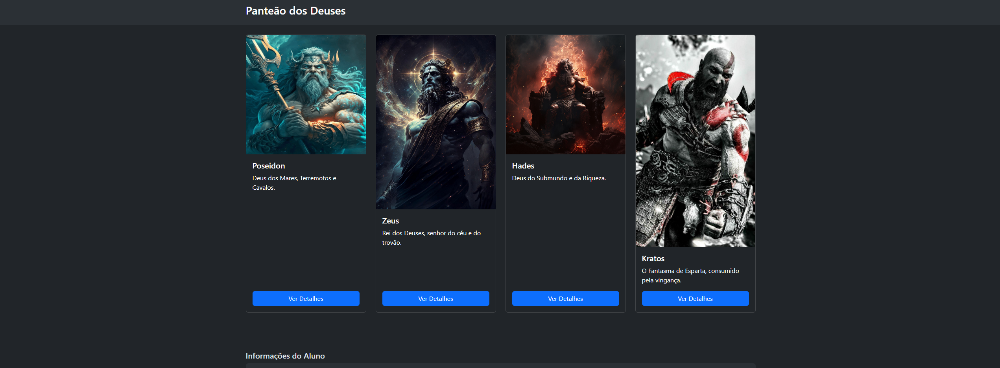
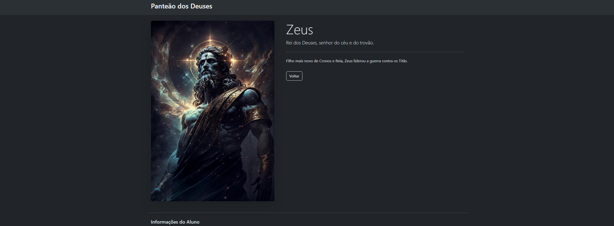

# Trabalho Prático 05 - Semanas 7 e 8

**Páginas de detalhes dinâmicas**

Nessa etapa, vamos evoluir o trabalho anterior, acrescentando a página de detalhes, conforme o  projeto escolhido. Imagine que a página principal (home-page) mostre um visão dos vários itens que existem no seu site. Ao clicar em um item, você é direcionado pra a página de detalhes. A página de detalhe vai mostrar todas as informações sobre o item do seu projeto. seja esse item uma notícia, filme, receita, lugar turístico ou evento.

Leia o enunciado completo no Canvas. 

**IMPORTANTE:** Assim como informado anteriormente, capriche na etapa pois você vai precisar dessa parte para as próximas semanas. 

**IMPORTANTE:** Você deve trabalhar e alterar apenas arquivos dentro da pasta **`public`,** mantendo os arquivos **`index.html`**, **`styles.css`** e **`app.js`** com estes nomes, conforme enunciado. Deixe todos os demais arquivos e pastas desse repositório inalterados. **PRESTE MUITA ATENÇÃO NISSO.**

## Informações Gerais

- Nome:Bruno Henrique Guedes Da Cruz 
- Matricula:898113
- Proposta de projeto escolhida: Bibliografia de god of war
- Breve descrição sobre seu projeto: Tento contar sobre curiosidades de um jogo aclamado mundialmente

## Print da Home-Page

## Print da página de detalhes do item

## Cole aqui abaixo a estrutura JSON utilizada no app.js
// app.js - VERSÃO FINAL PARA FUNCIONAR SEM SERVIDOR

const dados = [
  {
    "id": 0, "titulo": "Poseidon", "imagem": "img/poseidon.png",
    "descricao": "Deus dos Mares, Terremotos e Cavalos.",
    "conteudo": "Poseidon era um dos Doze Olimpianos e seu palácio ficava no fundo do oceano."
  },
  {
    "id": 1, "titulo": "Zeus", "imagem": "img/Zeus.jpg",
    "descricao": "Rei dos Deuses, senhor do céu e do trovão.",
    "conteudo": "Filho mais novo de Cronos e Reia, Zeus liderou a guerra contra os Titãs."
  },
  {
    "id": 2, "titulo": "Hades", "imagem": "img/hades.jpg",
    "descricao": "Deus do Submundo e da Riqueza.",
    "conteudo": "Embora temido, Hades não era o deus da morte, mas o senhor do reino dos mortos."
  },
  {
    "id": 3, "titulo": "Kratos", "imagem": "img/kratos.jpg",
    "descricao": "O Fantasma de Esparta, consumido pela vingança.",
    "conteudo": "Kratos foi um general espartano que vendeu sua alma a Ares para matar sua própria família."
  }
];

document.addEventListener('DOMContentLoaded', () => {
    const paginaAtual = window.location.pathname.split("/").pop();
    if (paginaAtual.startsWith('index')) {
        montarPaginaHome();
    } else if (paginaAtual.startsWith('detalhes')) {
        montarPaginaDetalhes();
    }
});

function montarPaginaHome() {
    const containerLista = document.getElementById('lista-itens');
    if (!containerLista) return;
    containerLista.innerHTML = dados.map(item => `
        

            

                
                

                    <h5 class="card-title">${item.titulo}</h5>
                    
${item.descricao}

                    <a href="detalhes.html?id=${item.id}" class="btn btn-primary mt-auto">Ver Detalhes</a>
                

            

        

    `).join('');
}

function montarPaginaDetalhes() {
    const containerDetalhe = document.getElementById('detalhe-item');
    if (!containerDetalhe) return;
    const params = new URLSearchParams(window.location.search);
    const id = parseInt(params.get('id'));
    const item = dados.find(d => d.id === id);
    if (item) {
        containerDetalhe.innerHTML = `
            

                

                

                    <h1 class="display-4">${item.titulo}</h1>
                    
${item.descricao}

                    

                    
${item.conteudo}

                    <!-- ESTE BOTÃO FUNCIONA 100% DAS VEZES SEM SERVIDOR -->
                    <a href="javascript:history.back()" class="btn btn-outline-light mt-3">Voltar</a>
                

            

        `;
    } else {
        containerDetalhe.innerHTML = '
Item não encontrado.
';
    }
}
