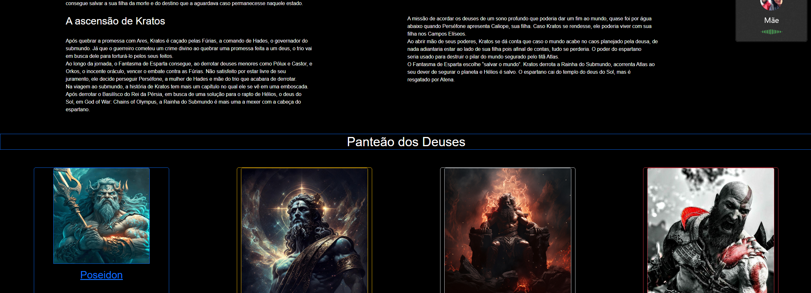
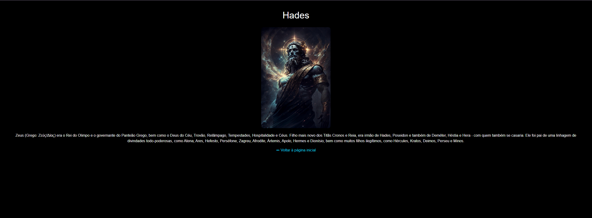

# Trabalho Prático 05 - Semanas 7 e 8

**Páginas de detalhes dinâmicas**

Nessa etapa, vamos evoluir o trabalho anterior, acrescentando a página de detalhes, conforme o  projeto escolhido. Imagine que a página principal (home-page) mostre um visão dos vários itens que existem no seu site. Ao clicar em um item, você é direcionado pra a página de detalhes. A página de detalhe vai mostrar todas as informações sobre o item do seu projeto. seja esse item uma notícia, filme, receita, lugar turístico ou evento.

Leia o enunciado completo no Canvas. 

**IMPORTANTE:** Assim como informado anteriormente, capriche na etapa pois você vai precisar dessa parte para as próximas semanas. 

**IMPORTANTE:** Você deve trabalhar e alterar apenas arquivos dentro da pasta **`public`,** mantendo os arquivos **`index.html`**, **`styles.css`** e **`app.js`** com estes nomes, conforme enunciado. Deixe todos os demais arquivos e pastas desse repositório inalterados. **PRESTE MUITA ATENÇÃO NISSO.**

## Informações Gerais

- Nome:Bruno Henrique Guedes Da Cruz 
- Matricula:898113
- Proposta de projeto escolhida: Bibliografia de god of war
- Breve descrição sobre seu projeto: Tento contar sobre curiosidades de um jogo aclamado mundialmente

## Print da Home-Page

## Print da página de detalhes do item

## Cole aqui abaixo a estrutura JSON utilizada no app.js
const Deuses = [
  {
    id: 0,
    figura: "img/poseidon.jpg",
    titulo: "Poseidon",
    sobre: "(grego: Ποσειδῶν) era o Deus Olímpico dos Mares, Rios, Água, Tempestades, Ventos, Furacões, Chuva, Inundações, Secas, Terremotos e Equinos..."
  },
  {
    id: 1,
    figura: "img/zeus.jpg",
    titulo: "Zeus",
    sobre: "(grego: Ζεύς/Δίας) era o Rei do Olimpo e o governante do Panteão Grego..."
  },
  {
    id: 2,
    figura: "img/hades.jpg",
    titulo: "Hades",
    sobre: "(grego: ᾍδης) era o deus olímpico dos mortos e governante do submundo..."
  },
  {
    id: 3,
    figura: "img/kratos.jpg",
    titulo: "Kratos",
    sobre: "Kratos refere-se a duas entidades: Cratos da mitologia grega, o deus da força..."
  }
];

